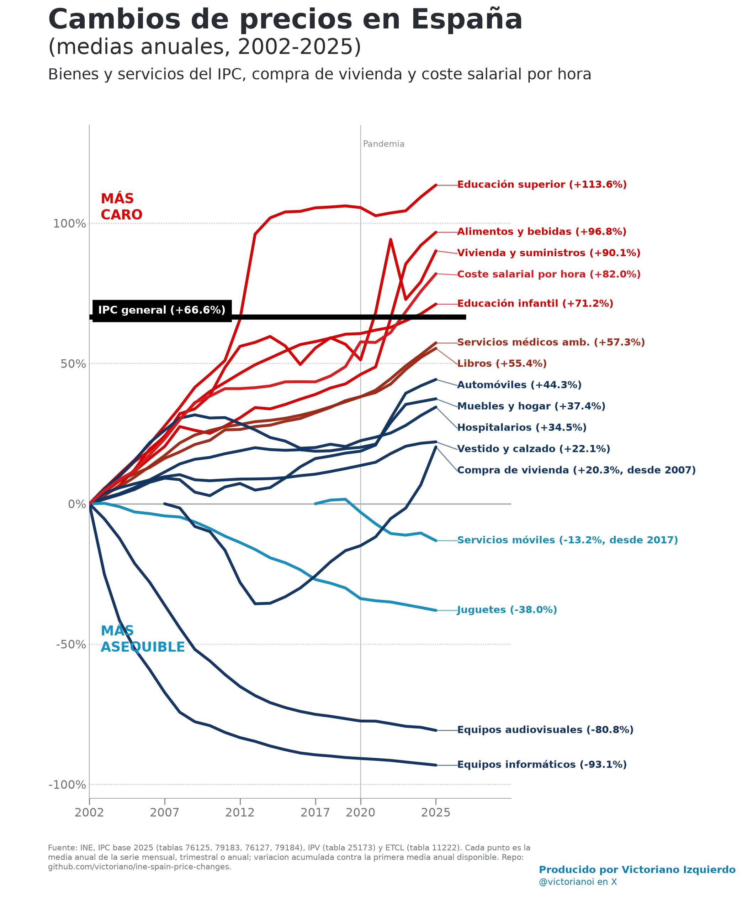
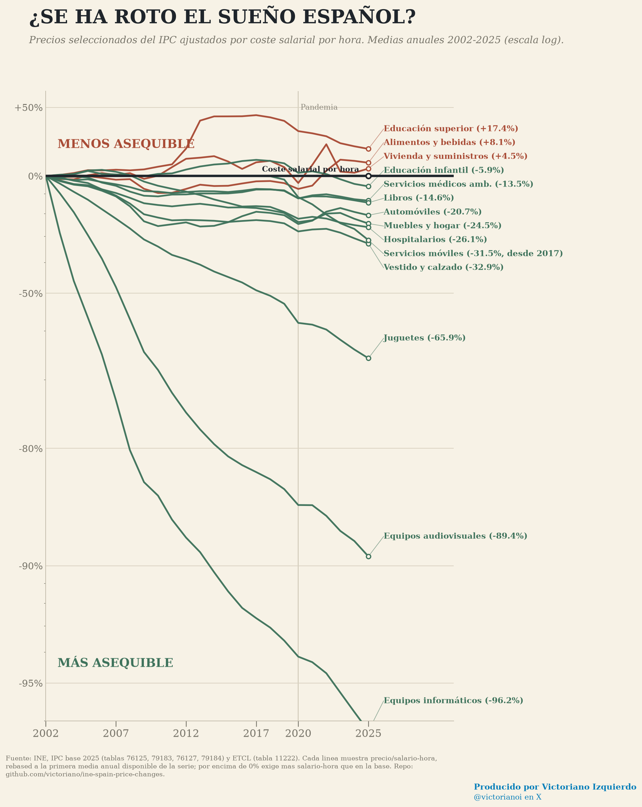

# Cambios de precios en España

Recreación para España del gráfico de cambios acumulados de precios de bienes y servicios, usando medias anuales de datos oficiales del INE.

## Cambios de precios



Última versión del gráfico: medias anuales `2002-2025`, referencia vertical en `2020`, fuente INE, URL del repo y autoría de Victoriano Izquierdo / `@victorianoi`.

## Asequibilidad ajustada por salarios



Este segundo gráfico divide cada serie de precios por el coste salarial por hora. Por encima de `0%`, la partida exige más salario-hora que en el año base; por debajo de `0%`, exige menos.

## Qué incluye

- `outputs/ine-price-changes-spain/ine_spain_price_changes.png`: gráfico final en PNG.
- `outputs/ine-price-changes-spain/ine_spain_price_changes.svg`: versión vectorial.
- `outputs/ine-price-changes-spain/ine_spain_price_changes_series.csv`: series anuales normalizadas usadas para dibujar.
- `outputs/ine-price-changes-spain/ine_spain_price_changes_summary.csv`: tabla resumen con el cambio acumulado final.
- `outputs/ine-price-changes-spain/summary.json`: el mismo resumen en JSON.
- `outputs/ine-price-changes-spain/ine_spain_affordability_wages.png`: gráfico ajustado por coste salarial por hora.
- `outputs/ine-price-changes-spain/ine_spain_affordability_wages.svg`: versión vectorial del gráfico ajustado por salarios.
- `outputs/ine-price-changes-spain/ine_spain_affordability_wages_series.csv`: series de asequibilidad usadas para dibujar.
- `outputs/ine-price-changes-spain/ine_spain_affordability_wages_summary.csv`: resumen final de asequibilidad por partida.
- `outputs/ine-price-changes-spain/affordability_summary.json`: el mismo resumen de asequibilidad en JSON.
- `scripts/data_viz/ine_price_changes_spain.py`: script reproducible que descarga los datos del INE y regenera los archivos.

## Metodología

El periodo principal es `2002-2025`. Cada punto del gráfico es la media anual de la serie mensual o trimestral correspondiente. Uso medias anuales para evitar que partidas muy estacionales, como vestido y calzado, introduzcan dientes de sierra mensuales.

La variación de cada línea se calcula contra la primera media anual disponible dentro del periodo. La línea negra es el IPC general acumulado desde la media anual de `2002` hasta la media anual de `2025`. El coste salarial por hora procede de la ETCL y se agrega desde datos trimestrales. La serie de servicios móviles empieza en `2017`, porque no está disponible con la subclase actual desde 2002.

El eje incluye una referencia vertical gris en `2020` para situar la pandemia.

El gráfico de asequibilidad usa la fórmula `precio normalizado / salario normalizado - 1`, con escala logarítmica para comparar mejor tanto las caídas fuertes como las subidas.

Algunas categorías son equivalentes aproximados de las del gráfico estadounidense original:

- `Libros` se usa como proxy de libros de texto.
- `Automóviles` se usa como proxy de coches nuevos, porque la subclase de automóviles nuevos arranca en 2017.
- `Equipos audiovisuales` se usa como proxy de TVs.
- `Equipos informáticos` se usa como proxy de software/equipo informático.
- `Vivienda y suministros` es el grupo del IPC español; no incluye vivienda en propiedad imputada.

## Fuentes

- INE IPC grupos: https://www.ine.es/jaxiT3/files/t/csv_bdsc/76125.csv
- INE IPC subgrupos: https://www.ine.es/jaxiT3/files/t/csv_bdsc/79183.csv
- INE IPC clases: https://www.ine.es/jaxiT3/files/t/csv_bdsc/76127.csv
- INE IPC subclases: https://www.ine.es/jaxiT3/files/t/csv_bdsc/79184.csv
- INE ETCL salarios por hora: https://www.ine.es/jaxiT3/files/t/csv_bdsc/11222.csv

## Regenerar

Con `uv`:

```bash
uv run scripts/data_viz/ine_price_changes_spain.py
```

El script escribe los artefactos en `outputs/ine-price-changes-spain/`.
