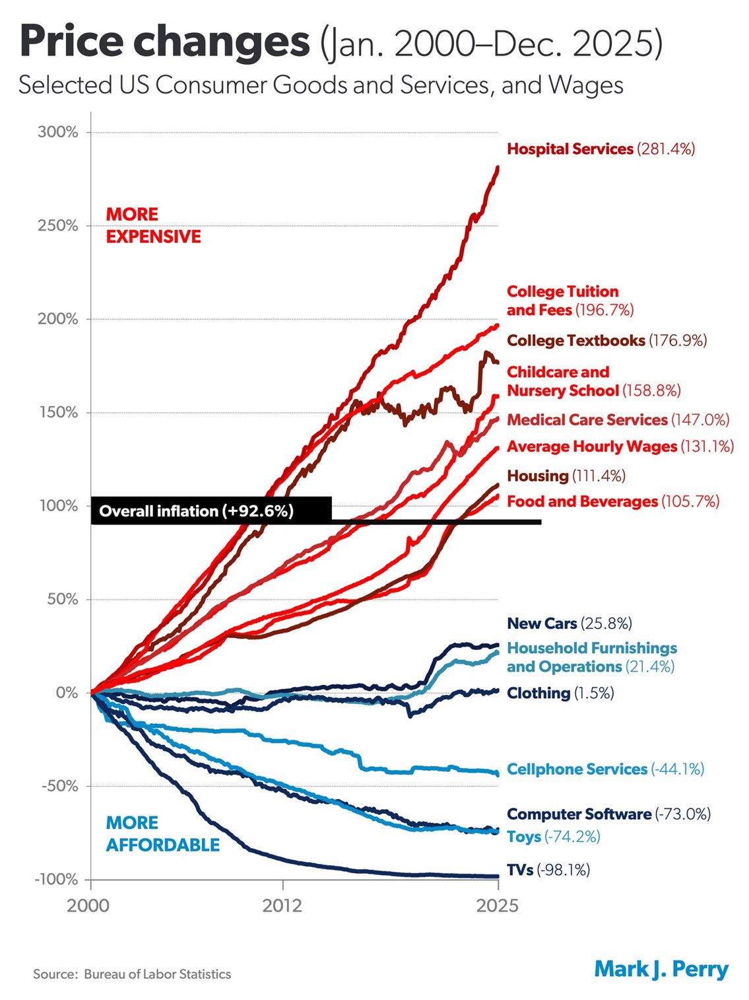
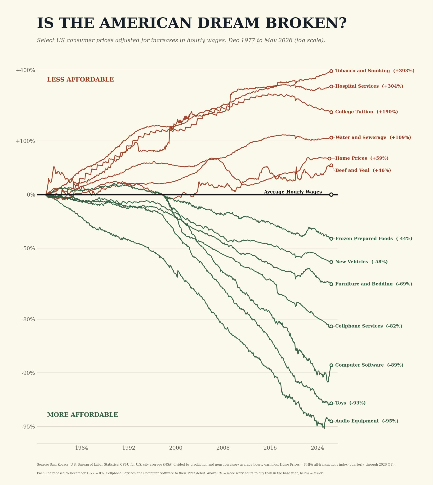

# Cambios de precios en España

Recreación para España del gráfico de cambios acumulados de precios de bienes y servicios, usando medias anuales de datos oficiales del INE.

## Cambios de precios


Última versión del gráfico: medias anuales `2002-2025`, referencia vertical en `2020`, fuente INE, línea de `Compra de vivienda` con el IPV, URL del repo y autoría de Victoriano Izquierdo / `@victorianoi`.

## Asequibilidad ajustada por salarios


Este segundo gráfico divide cada serie de precios por el salario mediano bruto anual. Por encima de `0%`, la partida exige más salario mediano que en el año base; por debajo de `0%`, exige menos. La serie de salario mediano del INE está disponible para `2008-2024`, así que este gráfico usa ese periodo. Además de las partidas del IPC, incluye una línea de `Compra de vivienda` con el Índice de Precios de Vivienda del INE.

## Poder adquisitivo internacional


Este gráfico compara España, Francia, Reino Unido, Suiza y EEUU con datos de WID.world. Cada curva muestra qué porcentaje de adultos queda por encima de cada nivel de renta anual equivalente, convertida a euros-PPA mediante paridad de poder adquisitivo. La visualización muestra percentiles `5-99` para evitar el arranque mecánico en `100%` cuando el umbral es casi cero; los CSV conservan `p0-p99`. El panel derecho resume qué porcentaje de cada país supera la mediana española de `2024`.

No es una distribución de salario bruto. Usa renta nacional post-impuestos por adulto equivalente, que incluye redistribución en especie/gasto público imputado; por eso es más útil para comparar nivel de vida amplio, pero debe leerse con esa cautela.

## Originales de referencia

Estos son los dos gráficos estadounidenses originales usados como inspiración visual y metodológica.





## Qué incluye

- `outputs/ine-price-changes-spain/ine_spain_price_changes.png`: gráfico final en PNG.
- `outputs/ine-price-changes-spain/ine_spain_price_changes.svg`: versión vectorial.
- `outputs/ine-price-changes-spain/ine_spain_price_changes_series.csv`: series anuales normalizadas usadas para dibujar.
- `outputs/ine-price-changes-spain/ine_spain_price_changes_summary.csv`: tabla resumen con el cambio acumulado final.
- `outputs/ine-price-changes-spain/ine_spain_median_wage_series.csv`: serie anual de salario mediano bruto usada como denominador del gráfico de asequibilidad.
- `outputs/ine-price-changes-spain/ine_spain_home_purchase_series.csv`: Índice de Precios de Vivienda nacional general usado para la línea de compra de vivienda.
- `outputs/ine-price-changes-spain/summary.json`: el mismo resumen en JSON.
- `outputs/ine-price-changes-spain/ine_spain_affordability_wages.png`: gráfico ajustado por salario mediano bruto anual.
- `outputs/ine-price-changes-spain/ine_spain_affordability_wages.svg`: versión vectorial del gráfico ajustado por salarios.
- `outputs/ine-price-changes-spain/ine_spain_affordability_wages_series.csv`: series de asequibilidad usadas para dibujar.
- `outputs/ine-price-changes-spain/ine_spain_affordability_wages_summary.csv`: resumen final de asequibilidad por partida.
- `outputs/ine-price-changes-spain/affordability_summary.json`: el mismo resumen de asequibilidad en JSON.
- `outputs/international-purchasing-power/international_purchasing_power.png`: gráfico internacional de poder adquisitivo en euros-PPA.
- `outputs/international-purchasing-power/international_purchasing_power.svg`: versión vectorial del gráfico internacional.
- `outputs/international-purchasing-power/international_purchasing_power_thresholds.csv`: umbrales WID por percentil, país y euros-PPA.
- `outputs/international-purchasing-power/international_purchasing_power_summary.csv`: resumen por país.
- `outputs/international-purchasing-power/summary.json`: el mismo resumen internacional en JSON.
- `references/originals/price-changes-us-original.png`: gráfico estadounidense original de cambios de precios.
- `references/originals/american-dream-broken-original.png`: gráfico estadounidense original de asequibilidad ajustada por salarios.
- `scripts/data_viz/ine_price_changes_spain.py`: script reproducible que descarga los datos del INE y regenera los archivos.
- `scripts/data_viz/international_purchasing_power.py`: script reproducible que descarga los datos WID y regenera la comparación internacional.

## Metodología

El periodo principal es `2002-2025`. Cada punto del gráfico es la media anual de la serie mensual o trimestral correspondiente. Uso medias anuales para evitar que partidas muy estacionales, como vestido y calzado, introduzcan dientes de sierra mensuales.

La variación de cada línea se calcula contra la primera media anual disponible dentro del periodo. La línea negra es el IPC general acumulado desde la media anual de `2002` hasta la media anual de `2025`. El coste salarial por hora procede de la ETCL y se agrega desde datos trimestrales. La serie de servicios móviles empieza en `2017`, porque no está disponible con la subclase actual desde 2002.

El eje incluye una referencia vertical gris en `2020` para situar la pandemia.

El gráfico de asequibilidad usa la fórmula `precio normalizado / salario mediano normalizado - 1`, con escala logarítmica para comparar mejor tanto las caídas fuertes como las subidas. El denominador es el salario mediano bruto anual de la EAES, no el salario neto después de impuestos.

La vivienda debe leerse con cautela. `Vivienda y suministros` es el grupo del IPC español para vivienda, agua, electricidad, gas y otros combustibles, pero no mide la compra de vivienda en propiedad. Para capturar esa parte, los gráficos añaden `Compra de vivienda` con el Índice de Precios de Vivienda nacional general del INE. Aun así, esa línea mide precios de compraventa, no entrada, principal de hipoteca, tipos de interés ni esfuerzo financiero mensual.

Algunas categorías son equivalentes aproximados de las del gráfico estadounidense original:

- `Libros` se usa como proxy de libros de texto.
- `Automóviles` se usa como proxy de coches nuevos, porque la subclase de automóviles nuevos arranca en 2017.
- `Equipos audiovisuales` se usa como proxy de TVs.
- `Equipos informáticos` se usa como proxy de software/equipo informático.
- `Vivienda y suministros` es el grupo del IPC español; no incluye vivienda en propiedad imputada.
- `Compra de vivienda` usa el Índice de Precios de Vivienda nacional general del INE; se interpreta con base `2007` en el primer gráfico y base `2008` en el gráfico de asequibilidad, porque el salario mediano arranca en 2008.

## Fuentes

- INE IPC grupos: https://www.ine.es/jaxiT3/files/t/csv_bdsc/76125.csv
- INE IPC subgrupos: https://www.ine.es/jaxiT3/files/t/csv_bdsc/79183.csv
- INE IPC clases: https://www.ine.es/jaxiT3/files/t/csv_bdsc/76127.csv
- INE IPC subclases: https://www.ine.es/jaxiT3/files/t/csv_bdsc/79184.csv
- INE IPV compra de vivienda: https://www.ine.es/jaxiT3/files/t/csv_bdsc/25173.csv
- INE ETCL salarios por hora: https://www.ine.es/jaxiT3/files/t/csv_bdsc/11222.csv
- INE EAES salario mediano bruto anual: https://www.ine.es/jaxiT3/files/t/csv_bdsc/28191.csv
- WID.world datos y descargas bulk: https://wid.world/data/
- WID.world diccionario de códigos: https://wid.world/codes-dictionary/

## Regenerar

Con `uv`:

```bash
uv run scripts/data_viz/ine_price_changes_spain.py
uv run scripts/data_viz/international_purchasing_power.py
```

Los scripts escriben los artefactos en `outputs/ine-price-changes-spain/` y `outputs/international-purchasing-power/`.
