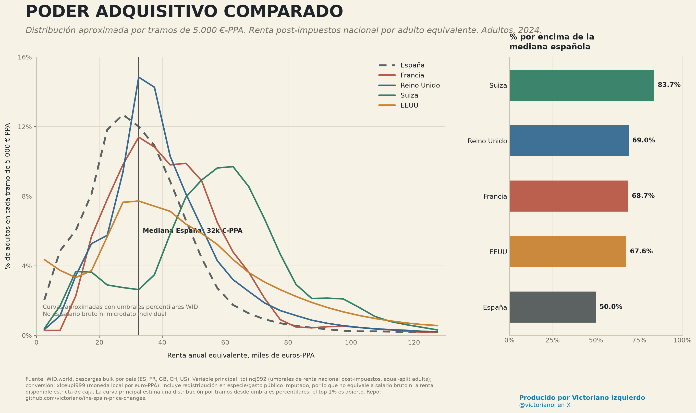

# Poder adquisitivo internacional

Comparación de España, Francia, Reino Unido, Suiza y EEUU con datos de WID.world. La renta se convierte a euros ajustados por paridad de poder adquisitivo (euros-PPA), no por tipo de cambio de mercado.

## Resumen

Referencia: mediana española de `2024`, `32.380` euros-PPA por adulto equivalente.

| País | Mediana €-PPA | Media €-PPA | % por encima de la mediana española |
| --- | ---: | ---: | ---: |
| Suiza | 58.605 | 61.702 | 83.7% |
| Reino Unido | 37.793 | 47.292 | 69.0% |
| Francia | 40.317 | 46.274 | 68.7% |
| EEUU | 44.219 | 62.303 | 67.6% |
| España | 32.380 | 37.846 | 50.0% |

## Metodología

- Fuente: WID.world bulk downloads por país.
- Variable de renta: `tdiincj992`, umbral de renta nacional post-impuestos por percentil, adultos `equal-split`.
- Conversión a euros-PPA: cada umbral local se divide por `xlceupi999`, el factor de moneda local por euro-PPA.
- El panel principal aproxima una distribución: qué porcentaje de adultos cae en cada tramo de 5.000 euros-PPA. Se calcula interpolando los umbrales percentilares de WID, no con microdatos individuales.
- El panel derecho resume qué porcentaje de cada país supera la mediana española.

Esta no es una distribución de salario bruto. Es una métrica más amplia de nivel de vida porque incluye redistribución en especie/gasto público imputado dentro de la renta nacional post-impuestos. WID tiene también `cainc` para renta disponible post-impuestos estricta, pero en la descarga actual no ofrece umbrales/promedios con granularidad suficiente para construir este gráfico comparable.

## Archivos

- `international_purchasing_power.png`: gráfico final en PNG.
- `international_purchasing_power.svg`: versión vectorial.
- `international_purchasing_power_thresholds.csv`: umbrales por percentil, país y euros-PPA.
- `international_purchasing_power_distribution.csv`: distribución aproximada por tramos de 5.000 euros-PPA.
- `international_purchasing_power_summary.csv`: resumen por país.
- `summary.json`: resumen en JSON.
